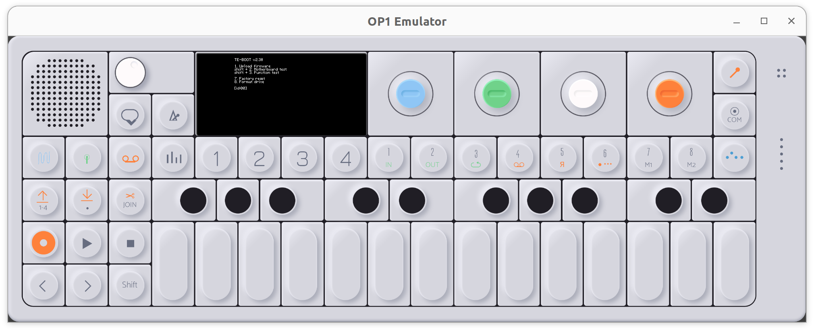

# OP-1 Emulator

An emulator for the Teenage Engineering OP-1 synthesizer.
Still work in progress.

Test with op1_246.op1/te-boot.ldr



## Building

```bash
git clone https://github.com/op1emu/op1emu.git
cd op1emu
git submodule update --init --recursive

mkdir build
cmake -B build -GNinja
cmake --build build
./build/op1emu path/to/te-boot.ldr path/to/nandflash.img
```

## Acknowledgements
- [bfin_sim](https://github.com/op1emu/bfin_sim) - Blackfin simulator used for CPU emulation, from gdb/sim.
- [op1kenobi](https://github.com/alexmandelshtam/op1kenobi) - OP-1 screenshot assets used for the GUI background.