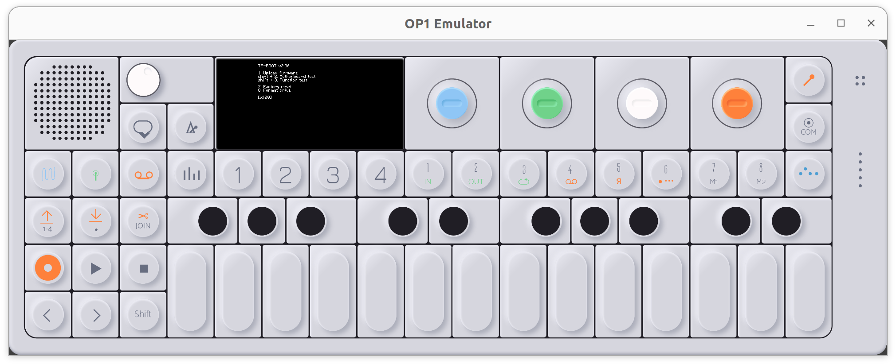

# OP-1 Emulator

An emulator for the Teenage Engineering OP-1 synthesizer.
Still work in progress.

Test with op1_246.op1/te-boot.ldr



## Building

```bash
git clone https://github.com/op1emu/op1emu.git
cd op1emu
git submodule update --init --recursive

mkdir build
cmake -B build -GNinja
cmake --build build
./build/op1emu path/to/nandflash.img path/to/te-boot.ldr
```

## Headless operation

Run from the repository root with the matching `otp.bin`:

```bash
./build/op1emu nand.bin --nand-snapshot --headless
```

No GLFW initialization, window, OpenGL rendering, or host audio device is
started. The existing executable still links GLFW/OpenGL and needs their build
dependencies. PPI/DMA, SPORT sample timing, frame-sync callbacks, USB/IP, and CPU
execution continue. The main loop retains its 16 ms sleep, random accelerometer
feed, and midpoint volume. Frame pixels and host audio output are discarded.

Enter one command per line on stdin (press Enter in a terminal):

```text
keys
tap synth
press shift
tap play 200
release shift
quit
```

`keys` lists the button names from `gui/ui.json`, including `play`, `stop`,
`shift`, `c4`, `f3#`, and encoder **push** buttons `enc1` through `enc4`.
`press KEY` holds a key until `release KEY`; use these for chords.
`tap KEY [MS]` holds and releases it (default 100 ms).
`wait MS` delays subsequent commands while emulation and frame sync continue.
Durations are integer wall-clock milliseconds, from 1 to 86400000, serviced at
the host loop cadence. They are not deterministic guest-cycle timestamps;
short presses can be missed while firmware is busy compiling or booting.
Explicit press/release pairs need a wait between them to be observable by firmware.

For replay, save the following as `keys.txt` and pass
`--headless --input-script keys.txt`:

```text
# Allow this firmware and machine time to boot; adjust as needed.
wait 120000
tap synth
wait 500
tap c4 500
wait 1000
quit
```

Scripts and stdin use the same commands. Blank lines and lines beginning with
`#` are ignored. EOF leaves the emulator running, including any pending tap
release; `quit`, SIGINT, or SIGTERM requests clean shutdown. Invalid commands
report an error and exit nonzero. Log lines say when input was **queued**, not
when firmware handled it. NAND writes are persistent unless `--nand-snapshot` is
selected. When comparing timings, use the same frontend mode for every run:
removing GL swaps and host audio changes host overhead and frame cadence.

Frontend regressions (including the CPU input event queue) can be built with:

```bash
cmake -S . -B build -DOP1_BUILD_HEADLESS_TESTS=ON
cmake --build build --target op1-headless-test
ctest --test-dir build -R headless-test --output-on-failure
```

## Acknowledgements
- [bfin_sim](https://github.com/op1emu/bfin_sim) - Blackfin simulator used for CPU emulation, from gdb/sim.
- [op1kenobi](https://github.com/alexmandelshtam/op1kenobi) - OP-1 screenshot assets used for the GUI background.
